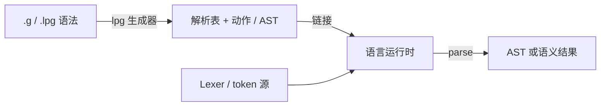

# LPG2 概念：心智模型

本文说明「各部件各自做什么」，几乎不贴长命令。动手跑通请先看 [QUICKSTART.md](QUICKSTART.md)；跟读语法见 [tutorial.md](tutorial.md)。English: [en/CONCEPTS.md](en/CONCEPTS.md)。

本仓库**不教**形式语言或编译原理教材；指令速查见 [GRAMMAR_REFERENCE.md](GRAMMAR_REFERENCE.md)。

## 一条流水线



| 角色 | 职责 | 本仓库里在哪 |
|------|------|----------------|
| **生成器** | 读语法，写出目标语言的表与（可选）AST/动作代码 | `lpg-v2.3.0`（Release 或 `lpg2/build/`） |
| **模板** | 决定生成代码长什么样（确定性 parser、回溯等） | `lpg-generator-templates-2.1.00/` |
| **运行时** | 查表、移进/归约、回溯、错误恢复 | `runtime/*` 各语言子模块 |
| **你的代码** | 词法（或 token 注入）、驱动 `parse`、消费 AST | 例如 `examples/calculator/*/Main*` |

常见误解：生成器**不会**自动给出完整工业级 lexer。calculator 示例故意用手写 token 列表，只验证「表 + 运行时」。

## 一份最小 `.g` 长什么样

摘自 [`examples/calculator/calculator.g`](../examples/calculator/calculator.g)：

```text
%Options automatic_ast=nested, ...
%Options template=dtParserTemplateF.gi

%Terminals          ← 终结符（token 种类）
    NUMBER PLUS STAR LPAREN RPAREN
%End

%Eof
    EOF_TOKEN       ← 输入结束
%End

%Start
    Expr            ← 开始符号
%End

%Rules              ← 产生式；Expr/Term/Factor 分层消歧
    Expr$Expr ::= Expr PLUS Term | Term
    Term$Term ::= Term STAR Factor | Factor
    Factor$Factor ::= NUMBER | LPAREN Expr RPAREN
%End
```

- `%Terminals` / `%Eof` / `%Start` / `%Rules` 是日常骨架
- `Nonterminal$ClassName`（如 `Expr$Expr`）在 `automatic_ast=nested` 时影响生成的 AST 类名
- `%Options template=…` 选模板；也可用 CLI `-programming_language=` / `-template=`

## 生成器产出什么

对某语言执行 `-table` 后，典型产物包括：

| 种类 | 常见文件名模式 | 含义 |
|------|----------------|------|
| 解析表 | `*prs.*` | 状态机 / 动作表，供运行时查询 |
| 符号表 | `*sym.*` | token / 非终结符编号常量 |
| 解析器/AST | `*.java` / `*.ts` / … | 依语言与 `automatic_ast` 选项 |

失败时采用事务式发布：不会留下半成品覆盖旧文件。只想检查冲突、不写文件时用 `-nowrite`。

## 解析时发生什么

1. **Lexer（或示例驱动）** 产出一串 token（种类 + 可选词法文本）
2. **运行时** 按当前状态与 lookahead 查表：shift 或 reduce
3. **归约** 时执行语义动作，或搭建 automatic AST 节点
4. 接受开始符号对应的归约后得到根结果；非法输入则报错（或走 `%Recover` 义肢节点，见进阶文档）

## 冲突直觉（shift / reduce）

同一 lookahead 下，解析器既可「移进下一个 token」，也可「用某条规则归约」时，就会报告 **shift/reduce conflict**。

计算器用 **Expr / Term / Factor 分层** 表达「`*` 比 `+` 紧」，从而避免冲突。也可以用 `%Left` / `%Right` 声明运算符优先级（见 tutorial 练习）。

默认：冲突只警告，退出码仍为 0。CI 建议加 `-fail_on_conflicts`（冲突时退出 12）。

## 推荐阅读顺序

1. [QUICKSTART.md](QUICKSTART.md) — 跑通
2. 本文 — 建立模型
3. [tutorial.md](tutorial.md) — 跟读 calculator
4. [USER.md](USER.md) — 集成与 FAQ
5. [GRAMMAR_REFERENCE.md](GRAMMAR_REFERENCE.md) — 指令与选项速查
6. [ECOSYSTEM.md](ECOSYSTEM.md) — 各语言运行时版本与发版
