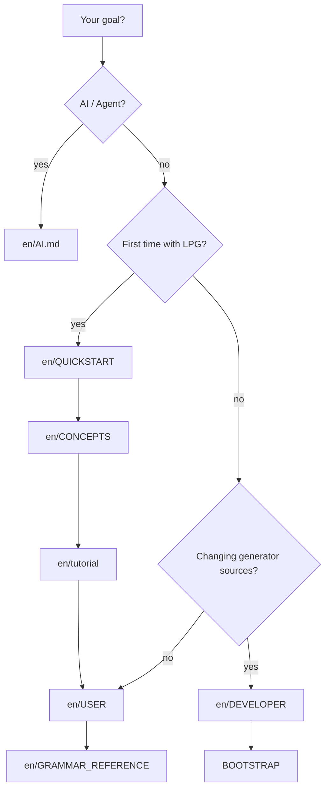

# LPG2 documentation

**Default language: English** (`docs/en/`). Chinese editions live beside them under `docs/*.md` ([中文索引](README.zh.md)).

## Which doc should I read?



| Document | Link |
|----------|------|
| Quick Start — run calculator in ~5 minutes | [en/QUICKSTART.md](en/QUICKSTART.md) |
| Concepts — generator / templates / runtime | [en/CONCEPTS.md](en/CONCEPTS.md) |
| Tutorial — calculator walkthrough | [en/tutorial.md](en/tutorial.md) |
| User guide — grammars, generation, runtimes | [en/USER.md](en/USER.md) |
| Developer guide — build, tests, backends | [en/DEVELOPER.md](en/DEVELOPER.md) |
| AI / Agent playbook | [en/AI.md](en/AI.md) |
| Ecosystem — versions, packages, release checklist | [ECOSYSTEM.md](ECOSYSTEM.md) |
| Grammar / CLI reference (EN summary) | [en/GRAMMAR_REFERENCE.md](en/GRAMMAR_REFERENCE.md) |
| Chinese documentation index | [README.zh.md](README.zh.md) |
| Ecosystem backlog | [TODO_TRIAGE.md](TODO_TRIAGE.md) |
| Bootstrap — regenerating `jikespg_*` | [../lpg2/BOOTSTRAP.md](../lpg2/BOOTSTRAP.md) |
| Contributing | [../CONTRIBUTING.md](../CONTRIBUTING.md) |
| Repo-root agent entry | [../AGENTS.md](../AGENTS.md) |
| Cursor project skill | [../.cursor/skills/lpg2/SKILL.md](../.cursor/skills/lpg2/SKILL.md) |

## Maintenance conventions

- Keep the executable name and version strings in sync with `LPG2_VERSION` in `lpg2/CMakeLists.txt`
- When changing CLI, exit codes, or diagnostic text: update [en/USER.md](en/USER.md) FAQ and [en/QUICKSTART.md](en/QUICKSTART.md); mirror in Chinese when the zh page exists
- When changing `examples/calculator/scripts/*`: update [en/tutorial.md](en/tutorial.md) and the Chinese tutorial
- **English (`docs/en/`) is the default user-facing authority** for Quick Start / Concepts / Tutorial / USER / DEVELOPER / AI. Chinese pages under `docs/` are maintained in parallel for Chinese readers
- AI-facing changes: sync [en/AI.md](en/AI.md), [AI.md](AI.md), [../AGENTS.md](../AGENTS.md), [../.cursor/skills/lpg2/SKILL.md](../.cursor/skills/lpg2/SKILL.md)

Relative-link health check (from repo root):

```bash
./scripts/check-doc-links.sh
```

[Back to repository home](../README.md)
