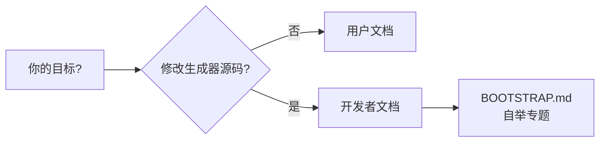

# LPG2 文档

## 我该读哪一份？

| 文档 | 链接 |
|------|------|
| 用户文档 — 写语法、生成解析器、集成运行时 | [USER.md](USER.md) |
| 开发者文档 — 构建、测试、扩展后端、子模块 | [DEVELOPER.md](DEVELOPER.md) |
| 入门教程 — 计算器语法 | [tutorial.md](tutorial.md) |
| English USER / DEVELOPER | [en/README.md](en/README.md) |
| TODO 分级 | [TODO_TRIAGE.md](TODO_TRIAGE.md) |
| 自举策略 — 重新生成 `jikespg_*` 的审查流程 | [../lpg2/BOOTSTRAP.md](../lpg2/BOOTSTRAP.md) |
| 贡献指南 | [../CONTRIBUTING.md](../CONTRIBUTING.md) |

[返回仓库首页](../README.md)
