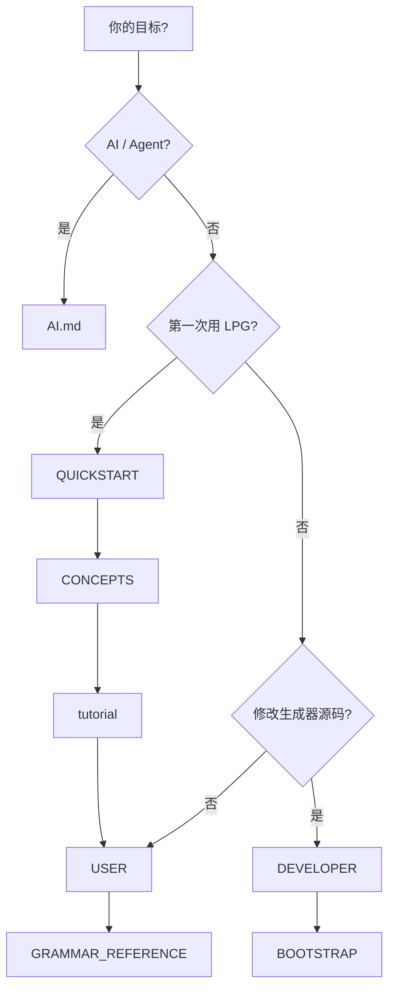

# LPG2 文档（中文）

默认文档语言为 **English**（[英文索引](README.md) / [`docs/en/`](en/README.md)）。本页为中文入口。

## 我该读哪一份？



| 文档 | 链接 |
|------|------|
| 5 分钟上手 — 跑通 calculator | [QUICKSTART.md](QUICKSTART.md) |
| 概念模型 — 生成器 / 模板 / 运行时 | [CONCEPTS.md](CONCEPTS.md) |
| 入门教程 — 计算器语法分步 | [tutorial.md](tutorial.md) |
| 用户文档 — 写语法、生成解析器、集成运行时 | [USER.md](USER.md) |
| 开发者文档 — 构建、测试、扩展后端、子模块 | [DEVELOPER.md](DEVELOPER.md) |
| AI / Agent 手册 — 给模型看的工作流与反模式 | [AI.md](AI.md) |
| 生态兼容 — 运行时版本、包坐标、发版清单 | [ECOSYSTEM.md](ECOSYSTEM.md) |
| 语法参考 — 指令、动作、AST、recover、CLI | [GRAMMAR_REFERENCE.md](GRAMMAR_REFERENCE.md) |
| English documentation index | [README.md](README.md) / [en/README.md](en/README.md) |
| 生态 backlog | [TODO_TRIAGE.md](TODO_TRIAGE.md) |
| 自举策略 — 重新生成 `jikespg_*` 的审查流程 | [../lpg2/BOOTSTRAP.md](../lpg2/BOOTSTRAP.md) |
| 贡献指南 | [../CONTRIBUTING.md](../CONTRIBUTING.md) |
| 仓库根 Agent 入口 | [../AGENTS.md](../AGENTS.md) |
| Cursor 项目 skill | [../.cursor/skills/lpg2/SKILL.md](../.cursor/skills/lpg2/SKILL.md) |

## 文档维护约定

- 可执行文件名与文中版本号随 `lpg2/CMakeLists.txt` 的 `LPG2_VERSION` 更新
- 改 CLI、退出码或诊断文案时：优先更新英文 [en/USER.md](en/USER.md) / [en/QUICKSTART.md](en/QUICKSTART.md)，并同步对应中文页
- 改 `examples/calculator/scripts/*` 时：同步 [en/tutorial.md](en/tutorial.md) 与 [tutorial.md](tutorial.md)
- **用户向默认权威为英文 `docs/en/`**；`docs/*.md` 中文页与之并行维护
- AI 相关改动：同步 [en/AI.md](en/AI.md)、[AI.md](AI.md)、[../AGENTS.md](../AGENTS.md)、[../.cursor/skills/lpg2/SKILL.md](../.cursor/skills/lpg2/SKILL.md)

相对链接健康检查（仓库根目录）：

```bash
./scripts/check-doc-links.sh
```

[返回仓库首页](../README.md)
