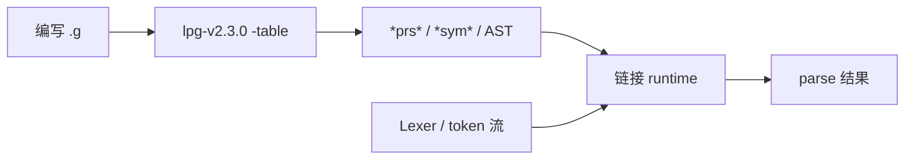

# LPG2 用户文档

面向**使用 LPG2 编写语法、生成解析器**的读者。若你要修改生成器本身，请参阅 [开发者文档](DEVELOPER.md)。

**建议阅读顺序（新手）：** [QUICKSTART.md](QUICKSTART.md) → [CONCEPTS.md](CONCEPTS.md) → [tutorial.md](tutorial.md) → 本文。

## LPG2 是什么

LPG2（Lookahead Parser Generator v2）读取 `.g` / `.lpg` 语法文件，生成目标语言的**解析表**和**语义动作代码**。支持 LALR 解析、回溯消歧、语法继承与 AST 生成。

当前版本：**2.3.0**（可执行文件名 `lpg-v2.3.0`）。

## 获取生成器

### 方式零：npm（`npx lpg2`）

```bash
npx lpg2 --help
npx lpg2 -programming_language=typescript -table grammar.g
```

`postinstall` 会按平台从 GitHub Releases 拉取 `lpg-v2.3.0` 与模板。源码在 [`npm/lpg2/`](../npm/lpg2/)。可用 `LPG_BIN` / `LPG2_NPM_SKIP_DOWNLOAD=1` 覆盖下载行为。

浏览器试用（WASM）：[`playground/`](../playground/)（GitHub Pages / 本地 `./scripts/build-wasm.sh`）。

### 方式一：GitHub Release（推荐）

从 [GitHub Releases](https://github.com/A-LPG/LPG2/releases) 下载
Linux、macOS 或 Windows 压缩包并校验
`SHA256SUMS`。解压后的 `bin/` 包含生成器，`share/lpg2/` 包含各语言模板。

压缩包保持原目录结构时，生成器会自动发现对应语言的模板。若单独移动二进制，
可用环境变量覆盖搜索路径。例如 Rust：

```bash
export LPG_TEMPLATE="/path/to/templates/rust"
export LPG_INCLUDE="/path/to/include/rust"
```

### 方式二：VS Code 扩展

从 Marketplace 安装 [lpg-vscode](https://marketplace.visualstudio.com/items?itemName=kuafuwang.lpg-vscode) 的**发布包**后，扩展会自带模板、语言服务与生成器二进制，可直接在编辑器中编写语法并触发生成。

本仓库中的扩展源码位于 `tool/LPG-VScode/`（子模块）。干净克隆不会包含已装配的 `templates/` 与 `server/`（见 `.gitignore`）；本地联调或打 VSIX 前请运行 `tool/LPG-VScode/scripts/assemble-release.sh`（见 [开发者文档](DEVELOPER.md)）。

### 方式三：从源码编译

```bash
cd lpg2
cmake -S . -B build
cmake --build build -j
cmake --install build --prefix ./install
./install/bin/lpg-v2.3.0 --help
```

### 安装树布局

`cmake --install` / CPack 包解压后典型结构：

```text
prefix/
├── bin/
│   └── lpg-v2.3.0              # 生成器可执行文件
├── share/lpg2/
│   └── lpg-generator-templates-2.1.00/
│       ├── templates/           # 各语言模板（java、rt_cpp、rust、…）
│       └── include/             # 对应 include 片段
└── share/doc/lpg2/              # 或 doc/（依平台 CMAKE_INSTALL_DOCDIR）
    ├── README.md
    ├── LICENSE
    └── USER.md
```

Release 压缩包使用相同布局：`bin/` + `share/lpg2/…`。生成器会相对自身位置自动发现模板；若单独移动二进制，请设置 `LPG_TEMPLATE` / `LPG_INCLUDE`（见上）。

## 基本工作流

心智模型见 [CONCEPTS.md](CONCEPTS.md)。端到端示意见 [QUICKSTART.md](QUICKSTART.md)。



1. 编写或修改 `.g` / `.lpg` 语法文件
2. 选择目标语言，运行生成器
3. 将生成的解析表与动作代码集成到对应语言的**运行时库**中

典型命令：

```bash
lpg-v2.3.0 -programming_language=cpp -table \
  -out_directory=./out \
  path/to/grammar.g
```

### 常用命令行参数

| 参数 | 说明 |
|------|------|
| `-programming_language=` | 目标语言（见下表） |
| `-table` | 生成解析表 |
| `-out_directory=` | 输出目录 |
| `-quiet` | 减少控制台输出 |
| `-nowrite` / `--dry-run` | 仅分析语法，不写文件（二者等价） |

完整参数列表：`lpg-v2.3.0 -help`

无参数、`-h`、`-help`、`--help` 和 `--version` 都成功返回 0；语法或选项错误
稳定返回 12，并把错误诊断写入 stderr。生成文件采用事务式发布：失败不会覆盖已有
产物，也不会留下半成品。`-out_directory` 同时控制解析表、动作文件和 `.l`
listing 文件的位置。

## 支持的目标语言

| 语言 | 参数值 | 状态 |
|------|--------|------|
| C++ | `cpp` / `c++` / `rt_cpp` | 完整支持（三者等价，均生成 `CppAction2`/`CppTable2`，可链接 `LPG-cpp-runtime`）；**GLR v2**（`-glr` + `rt_cpp/glrParserTemplateF.gi` + runtime `GLRParser` GSS/SPPF；CI 含 Catalan + SPPF 共享 e2e） |
| Java | `java` | 完整支持；CI 含 nested + recover AST e2e；**GLR v2**（`-glr` + `glrParserTemplateF.gi` + runtime `GLRParser` GSS/SPPF；`getNextAst()` 投影 + `getSppfRoot()`；覆盖 Catalan/相关性/RR/nullable/entry/循环拒绝/非 AST/SPPF 共享） |
| Python 3 | `python3` | 完整支持；CI 含 nested + recover AST e2e；**GLR v2**（`templates/python3/glrParserTemplateF.gi` + `python3_glr_ambiguous_e2e`） |
| C# | `csharp` | 完整支持；CI 含 nested + recover AST e2e；**GLR v2**（`templates/csharp/glrParserTemplateF.gi` + `csharp_glr_ambiguous_e2e`） |
| Go | `go` | 完整支持；CI 含 nested + recover AST e2e；**GLR v2**（`templates/go/glrParserTemplateF.gi` + `go_glr_ambiguous_e2e`） |
| Python 2 | `python2` | **已移除** — 请改用 `python3` |
| TypeScript | `typescript` | 完整支持；CI 含 nested + recover AST e2e；**GLR v2**（`-glr` + `templates/typescript/glrParserTemplateF.gi` + `lpg2ts` `GLRParser` GSS/SPPF；Playground 浏览器 demo） |
| Dart | `dart` | 完整支持；CI 含 nested + recover AST e2e；**GLR v2**（`templates/dart/glrParserTemplateF.gi` + `dart_glr_ambiguous_e2e`） |
| Rust | `rust` | 解析表、确定性/回溯 parser；automatic AST 已覆盖 `nested`（含无 `parent_saved` 的 `get_children`）、list、`parent_saved`、`needs_environment`、interface/`dyn` RHS 恢复、`visitor=default` / `visitor=preorder`（行为测试见 `rust_automatic_ast_*_behavior`）。**GLR v2**（`templates/rust/glrParserTemplateF.gi` + `rust_glr_ambiguous_e2e`）。复杂语法仍建议小步验证，不宣称与 Java/C++ 全量对等（不含 `toplevel` AST）。CI 含 recover e2e |

> **迁移说明：** 旧桩后端 `c` / `ml` / `plx` / `plxasm` / `xml` 已移除。请改用 `java`、`cpp`、`rt_cpp` 或其他完整后端。
>
> **recover / prosthetic AST：** **已支持全部 AST 后端**（Java、C++、Rust、Go、C#、TypeScript、Dart、Python）。`%Recover` 非终结符可带可选 action block（例：`Missing /. new AstToken(error_token) ./`），工厂表达式嵌入该 block（可引用 `error_token`）；无 block 时使用占位 `AstToken`（或各后端等价类型）。解析表提供 `getProsthesisIndex(kind)`，`BacktrackingParser` 重放非终结符错误 token 时合成节点而非抛异常。未启用自动 AST 的后端或未声明 `%Recover` 的文法仍保持抛异常行为。

## 运行时库

生成器只产出解析表与动作代码；实际解析需要各语言的**运行时**。本仓库 `runtime/` 目录包含对应子模块：

| 目录 | 语言 |
|------|------|
| `runtime/LPG-cpp-runtime` | C++ |
| `runtime/LPG-csharp-runtime` | C# |
| `runtime/LPG-go-runtime` | Go |
| `runtime/LPG-python-runtime` | Python |
| `runtime/LPG-typescript-runtime` | TypeScript |
| `runtime/LPG-Dart-runtime` | Dart |
| `runtime/LPG-rust-runtime` | Rust |
| `runtime/lpg-runtime` | Java |

### C++ 增量解析（定位说明）

C++ runtime（`LPG-cpp-runtime`）支持编辑器友好的 **token 级增量重词法** 与 **语句级增量重解析**：

- 在字符偏移处截断已损坏的 token 后缀：`PrsStream::incrementalResetAtCharacterOffset`
- 词法侧示例见 runtime 中的 `incrementalLexer`（damage 区间再扫）
- 解析侧可用 `DeterministicParser::parse(sym, index)` 从中间符号步进

这与 tree-sitter 的子树复用（`tree.edit()`）不同：LPG2 **复用 token 前缀 / 重跑受影响语句**，不保证跨编辑复用 AST 子树。需要增量编辑器集成时请按此模型设计；TypeScript 等其它 runtime 尚未统一暴露同等 API。

克隆含子模块的完整仓库：

```bash
git clone --recursive https://github.com/A-LPG/LPG2.git
```

## 示例语法

- 本仓库：`grammars-example/`（子模块）
- 独立集合：[LPG2-grammars-example](https://github.com/A-LPG/LPG2-grammars-example)

语料用 **quality** 分级（`language_port` / `language_subset` / `token_stream_smoke` / `legacy`），见 `grammars-example/catalog.json` → `quality_schema`。仅 `parse_ok` 不足以称为语言端口；smoke 单位是通用 token-stream。进度：`python3 grammars-example/tools/report.py`。

入门模板与更详细的 LPG 语法说明见 `lpg-generator-templates-2.1.00/docs/`。

## Rust 项目集成

1. 添加 [LPG-rust-runtime](https://github.com/A-LPG/LPG-rust-runtime) 依赖（本仓库子模块 `runtime/LPG-rust-runtime`，或 crates.io/git 依赖）
2. 用生成器产出 `*prs.rs` 与 `*sym.rs`：

```bash
lpg-v2.3.0 -programming_language=rust -table \
  -out_directory=src/generated \
  my_grammar.g
```

3. 在项目中 `mod` 引入生成文件，使用运行时提供的 `ParseTable` trait 驱动解析

生成文件需与 `LPG-rust-runtime` 版本匹配；升级任一侧时请重新生成并测试。

Rust 的 parser/table、backtracking 与 automatic AST（`nested`/`get_children`、list、
`parent_saved`、environment、interface、default / preorder visitor）会在回归测试中执行
`cargo test`（`rust_automatic_ast_*_behavior`）。请使用与生成器匹配的 `LPG-rust-runtime`；
复杂语法仍建议先用小 fixture 验证；不宣称 `toplevel`/GLR 全量对等。

## 语法特性：`%DropActions`

在 `import` 其他语法时，可使用 `%DropActions`：保留被导入语法的**规则结构**用于解析，但**忽略**其中的动作代码块。适用于复用别处的词法/句法，同时编写自己的语义。

## 工具链

| 组件 | 路径 / 链接 | 用途 |
|------|-------------|------|
| VS Code 扩展 | `tool/LPG-VScode` | 语法高亮、补全、诊断、一键生成 |
| 语言服务 | `tool/LPG-language-server` | 扩展后端 LSP |

## 常见问题

**诊断里的源码摘录与 `= help:` 是什么？**
自 2.3.0 起，错误/警告会附带源码摘录、插入符，以及对常见问题的修复建议。

**出现 `Shift/reduce conflict … (example lookahead: X)` 怎么办？**
用 `%Left` / `%Right` / `%Priority` 消歧、改写规则，或在 CI 中加 `-fail_on_conflicts` 让冲突直接失败。

**`Block not properly terminated`**
动作块必须用匹配的结束标记关闭（默认 `/.` … `./`）。

**旧桩后端 `c`/`ml`/`plx`/`plxasm`/`xml` 报错？**
这些语言值已移除。请改用 `java`、`cpp`、`rt_cpp`、`csharp`、`typescript`、`python3`、`dart`、`go` 或 `rust`。

**生成后如何编译进我的项目？**
将 `-out_directory` 设为项目源码树中的目录，并按对应 `runtime/` 子模块 README 的说明链接运行时库。

**`-nowrite` 有什么用？**
在改语法时快速检查冲突与错误，而不覆盖已有生成文件。

**Rust 与 C++/Go 等流程有何不同？**
命令相同。Rust 运行时在子模块 `runtime/LPG-rust-runtime`（crate `lpg2`），生成物为 Rust 模块。C++ 使用 `-programming_language=cpp`（或 `rt_cpp` / `c++`，等价）与 `rt_cpp` 模板链接 `runtime/LPG-cpp-runtime`（`cpplpg2`）。

**找不到模板 / `LPG_TEMPLATE`？**
Release 或 `cmake --install` 后保持 `bin/` 与 `share/lpg2/…` 相对布局；单独移动二进制时设置 `LPG_TEMPLATE` / `LPG_INCLUDE`。源码树开发可用 `-template=` / `-include-directory=` 指向 `lpg-generator-templates-2.1.00/`（见 calculator 脚本）。

**`runtime/` 目录几乎是空的？**
运行时是 git 子模块。执行 `git submodule update --init --recursive`，或按语言只 init 需要的路径（见 [QUICKSTART.md](QUICKSTART.md)）。

**已经生成了 `*prs*`，但程序不会 parse？**
生成器只产出表与动作/AST 代码；还需链接对应语言**运行时**，并由你的代码提供 token 流并调用 parse。跟读 [tutorial.md](tutorial.md) 中的驱动说明。

**Lexer 谁来写？生成器会生成词法分析器吗？**
日常工作流里 lexer 由你编写（或使用其它工具）。部分模板生态含词法相关示例，但 calculator 故意用手写 token 注入。见 [CONCEPTS.md](CONCEPTS.md)。

**该选 `java` 还是 `cpp` / `rt_cpp`？**
按宿主项目语言选后端即可。入门若尚未绑定语言，可用 Java（JDK + `runtime/lpg-runtime`）或 TypeScript 先跑通 calculator；C++ 三者别名 `cpp` / `c++` / `rt_cpp` 等价。矩阵见 [ECOSYSTEM.md](ECOSYSTEM.md)。

入门：[QUICKSTART.md](QUICKSTART.md) · [CONCEPTS.md](CONCEPTS.md) · [tutorial.md](tutorial.md) · 可运行示例：[../examples/calculator/](../examples/calculator/) · 语法参考：[GRAMMAR_REFERENCE.md](GRAMMAR_REFERENCE.md) · 生态兼容：[ECOSYSTEM.md](ECOSYSTEM.md)

---

下一步：[开发者文档](DEVELOPER.md) · [英文文档](en/README.md) · [仓库首页](../README.md)
