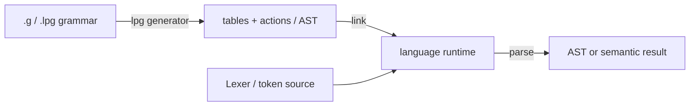

# LPG2 concepts (mental model)

What each piece does — almost no long command lists. Hands-on first: [QUICKSTART.md](QUICKSTART.md). Grammar walkthrough: [tutorial.md](tutorial.md). Chinese: [../CONCEPTS.md](../CONCEPTS.md).

This repo is **not** a formal-languages textbook. For directives, see [GRAMMAR_REFERENCE.md](GRAMMAR_REFERENCE.md) (full text in Chinese; English summary).

## One pipeline



| Role | Job | Where in this repo |
|------|-----|--------------------|
| **Generator** | Read grammar; emit tables and optional AST/actions | `lpg-v2.3.0` (Release or `lpg2/build/`) |
| **Templates** | Shape of generated code (deterministic vs backtracking, …) | `lpg-generator-templates-2.1.00/` |
| **Runtime** | Table lookup, shift/reduce, backtracking, recovery | `runtime/*` submodules |
| **Your code** | Lexer (or token injection), drive `parse`, consume AST | e.g. `examples/calculator/*/Main*` |

Common misconception: the generator does **not** give you a full industrial lexer. The calculator sample injects tokens on purpose to prove tables + runtime only.

## Minimal `.g` shape

From [`examples/calculator/calculator.g`](../../examples/calculator/calculator.g):

```text
%Options automatic_ast=nested, ...
%Options template=dtParserTemplateF.gi

%Terminals          ← terminal (token) kinds
    NUMBER PLUS STAR LPAREN RPAREN
%End

%Eof
    EOF_TOKEN       ← end of input
%End

%Start
    Expr            ← start symbol
%End

%Rules              ← productions; Expr/Term/Factor layers disambiguate
    Expr$Expr ::= Expr PLUS Term | Term
    Term$Term ::= Term STAR Factor | Factor
    Factor$Factor ::= NUMBER | LPAREN Expr RPAREN
%End
```

- `%Terminals` / `%Eof` / `%Start` / `%Rules` are the everyday skeleton
- `Nonterminal$ClassName` (e.g. `Expr$Expr`) names AST classes when `automatic_ast=nested`
- `%Options template=…` selects a template; CLI also has `-programming_language=` / `-template=`

## What the generator emits

After `-table` for a language, typical outputs:

| Kind | Name pattern | Meaning |
|------|--------------|---------|
| Parse table | `*prs.*` | State machine / action tables for the runtime |
| Symbol table | `*sym.*` | Token / nonterminal number constants |
| Parser / AST | `*.java` / `*.ts` / … | Depends on language and `automatic_ast` |

Failed runs use transactional publish: no half-written overwrite. Use `-nowrite` / `--dry-run` to check conflicts without writing files.

## What happens at parse time

1. **Lexer (or sample driver)** produces a token stream
2. **Runtime** looks up the table for shift or reduce given state + lookahead
3. On **reduce**, run semantic actions or build automatic AST nodes
4. Accept after reducing the start symbol; illegal input errors (or `%Recover` prosthetic nodes — advanced)

## Conflict intuition (shift / reduce)

When the same lookahead allows either “shift the next token” or “reduce by some rule”, you get a **shift/reduce conflict**.

The calculator uses **Expr / Term / Factor layering** so `*` binds tighter than `+` without conflicts. You can also declare `%Left` / `%Right` (see tutorial exercises).

Default: conflicts warn but exit 0. For CI, add `-fail_on_conflicts` (exit 12 on conflict).

## Reading order

1. [QUICKSTART.md](QUICKSTART.md)
2. This page
3. [tutorial.md](tutorial.md)
4. [USER.md](USER.md)
5. [../GRAMMAR_REFERENCE.md](../GRAMMAR_REFERENCE.md)
6. [../ECOSYSTEM.md](../ECOSYSTEM.md)
