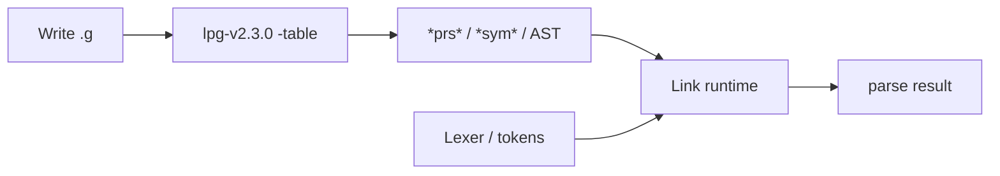

# LPG2 User Guide

For **authors of `.g` / `.lpg` grammars** and people integrating generated parsers. To change the generator itself, see [DEVELOPER.md](DEVELOPER.md).

Chinese edition: [../USER.md](../USER.md)

**Suggested reading (beginners):** [QUICKSTART.md](QUICKSTART.md) → [CONCEPTS.md](CONCEPTS.md) → [tutorial.md](tutorial.md) → this guide.

## What is LPG2?

LPG2 (Lookahead Parser Generator v2) reads `.g` / `.lpg` grammars and emits parse tables plus semantic-action stubs for the chosen language. It supports LALR parsing, backtracking disambiguation, grammar import, and automatic AST generation.

**Current version: 2.3.0** (`lpg-v2.3.0`).

## Obtaining the generator

1. **GitHub Releases** — download Linux / macOS / Windows archives and verify `SHA256SUMS`.
2. **VS Code extension** — [lpg-vscode](https://marketplace.visualstudio.com/items?itemName=kuafuwang.lpg-vscode).
3. **From source**:

```bash
cd lpg2
cmake -S . -B build && cmake --build build -j
cmake --install build --prefix ./install
./install/bin/lpg-v2.3.0 --help
```

### Install tree layout

After `cmake --install` or unpacking a Release archive:

```text
prefix/
├── bin/
│   └── lpg-v2.3.0
├── share/lpg2/
│   └── lpg-generator-templates-2.1.00/
│       ├── templates/
│       └── include/
└── share/doc/lpg2/   # or doc/ depending on CMAKE_INSTALL_DOCDIR
    ├── README.md
    ├── LICENSE
    └── USER.md
```

The generator auto-discovers templates relative to the binary. If you move the binary alone, set `LPG_TEMPLATE` / `LPG_INCLUDE`.

## Basic workflow

Mental model: [CONCEPTS.md](CONCEPTS.md). End-to-end sample: [QUICKSTART.md](QUICKSTART.md).



```bash
lpg-v2.3.0 -programming_language=cpp -table \
  -out_directory=./out \
  path/to/grammar.g
```

| Flag | Meaning |
|------|---------|
| `-programming_language=` | Target language (see table below) |
| `-table` | Emit parse tables |
| `-out_directory=` | Output directory |
| `-quiet` | Less console noise |
| `-fail_on_conflicts` | Treat shift/reduce conflicts as errors (exit 12) |

Help / version exit 0. Grammar or option errors exit **12** and print diagnostics on stderr. Failed runs do not leave half-written outputs.

### Diagnostics

Errors and warnings look like:

```text
path/grammar.g:10:13:10:13:...: Error: Block not properly terminated
  |     S ::= a /.
  |             ^
  = help: Close the action block with the matching end marker ...
```

## Supported languages

| Language | Value | Status |
|----------|-------|--------|
| C++ | `cpp` / `c++` / `rt_cpp` | Full (aliases; all emit `CppAction2`/`CppTable2`); **GLR v2** (`-glr` + `rt_cpp/glrParserTemplateF.gi` + runtime `GLRParser` GSS/SPPF; CI Catalan + SPPF share e2e) |
| Java | `java` | Full; CI nested + recover AST e2e; **GLR v2** (`-glr` + `glrParserTemplateF.gi` + runtime `GLRParser` GSS/SPPF; `getNextAst()` projection + `getSppfRoot()`; Catalan/correlation/RR/nullable/entry/cyclic-reject/non-AST/SPPF-share coverage) |
| Python 3 | `python3` | Full; CI nested + recover AST e2e |
| C# | `csharp` | Full; CI nested + recover AST e2e |
| Go | `go` | Full; CI nested + recover AST e2e |
| Python 2 | `python2` | **Removed** — CLI rejects; use `python3` |
| TypeScript | `typescript` | Full; CI nested + recover AST e2e; **GLR v2** (`-glr` + `templates/typescript/glrParserTemplateF.gi` + `lpg2ts` `GLRParser` GSS/SPPF; Playground browser demo) |
| Dart | `dart` | Full; CI nested + recover AST e2e |
| Rust | `rust` | Tables + parsers; automatic AST covers `nested` (incl. `get_children` without `parent_saved`), list, `parent_saved`, `needs_environment`, interface/`dyn` RHS recovery, default/preorder visitors (`rust_automatic_ast_*_behavior`). Complex grammars still warrant small-step validation; not full Java/C++ AST parity (no `toplevel`/GLR claim). CI includes recover e2e |

> **Migration:** Stub backends `c` / `ml` / `plx` / `plxasm` / `xml` have been **removed**. Use `java`, `cpp`, `rt_cpp`, or another full backend.
>
> **Recover / prosthetic AST:** Supported on **all shipped AST backends** — Java, C++, Rust, Go, C#, TypeScript, Dart, and Python. A `%Recover` nonterminal may include an optional action block (e.g. `Missing /. new AstToken(error_token) ./`) whose body is the factory expression (may reference `error_token`); without a block a placeholder `AstToken` (or the backend equivalent) is used. The table exposes `getProsthesisIndex(kind)`, and `BacktrackingParser` synthesizes a node instead of throwing when replaying a nonterminal error token. Backends without automatic AST, or grammars without `%Recover`, keep the historical throw behavior.

## Runtimes

Generated tables need a language runtime under `runtime/` (git submodules), including Rust at `runtime/LPG-rust-runtime`.

### C++ incremental parsing (honest positioning)

The C++ runtime supports **token-level incremental re-lexing** (`PrsStream::incrementalResetAtCharacterOffset`, lexer `incrementalLexer`) and **statement-level incremental re-parse** (`DeterministicParser::parse(vector, int)`). This is **not** tree-sitter subtree reuse (`tree.edit()`). See Chinese [USER.md](../USER.md) for the fuller note; contract tests: `incremental_prs_stream`, `cpp_automatic_ast_incremental`.

```bash
git clone --recursive https://github.com/A-LPG/LPG2.git
```

## Examples and tutorial

- Quick start: [QUICKSTART.md](QUICKSTART.md)
- Concepts: [CONCEPTS.md](CONCEPTS.md)
- Hands-on calculator: [tutorial.md](tutorial.md)
- Runnable sample: [../../examples/calculator/](../../examples/calculator/)
- Parse-level grammar corpus: [../../grammars-example/](../../grammars-example/) (antlr/grammars-v4 ports; see `catalog.json` and `CONTRIBUTING.md`)
- Units are graded by **quality** (`language_port` / `language_subset` / `token_stream_smoke` / `legacy` — see `quality_schema` in `catalog.json`). `parse_ok` alone is not a language port; many Wave C/D entries are smoke scaffolds only.

```bash
bash grammars-example/harness/run-one.sh json
python3 grammars-example/tools/classify_quality.py
python3 grammars-example/tools/report.py
```

## FAQ

**Q: I see `Shift/reduce conflict … (example lookahead: X)`. What now?**
A: Add `%Left` / `%Right` / `%Priority`, rewrite the ambiguous rules, or pass `-fail_on_conflicts` in CI so conflicts fail the build.

**Q: `Block not properly terminated`**
A: Action blocks must be closed (default markers `/.` … `./`).

**Q: Error about removed stub backend (`c`/`ml`/`plx`/`plxasm`/`xml`)**
A: Those language values are gone. Switch to `java`, `cpp`, `rt_cpp`, `csharp`, `typescript`, `python3`, `dart`, `go`, or `rust`.

**Q: Tables changed after a generator upgrade**
A: Compare against `lpg2/tests/golden/minimal/<lang>/` or re-run your project’s golden update script.

**Q: Templates / `LPG_TEMPLATE` not found?**
A: Keep the Release/`cmake --install` layout (`bin/` next to `share/lpg2/…`). If you move the binary alone, set `LPG_TEMPLATE` / `LPG_INCLUDE`. From a source checkout, pass `-template=` / `-include-directory=` under `lpg-generator-templates-2.1.00/` (see calculator scripts).

**Q: `runtime/` looks empty?**
A: Runtimes are git submodules. Run `git submodule update --init --recursive`, or init only the language you need ([QUICKSTART.md](QUICKSTART.md)).

**Q: I generated `*prs*` but nothing parses?**
A: The generator emits tables and action/AST code only. You still link a language **runtime** and supply a token stream. See the driver section in [tutorial.md](tutorial.md).

**Q: Who writes the lexer? Does LPG emit one?**
A: You write (or reuse) a lexer in the usual workflow. The calculator injects tokens on purpose. See [CONCEPTS.md](CONCEPTS.md).

**Q: `java` vs `cpp` / `rt_cpp`?**
A: Pick the backend that matches your host language. For a first run with no language lock-in, Java or TypeScript via calculator is easiest; `cpp` / `c++` / `rt_cpp` are aliases. Matrix: [../ECOSYSTEM.md](../ECOSYSTEM.md).
